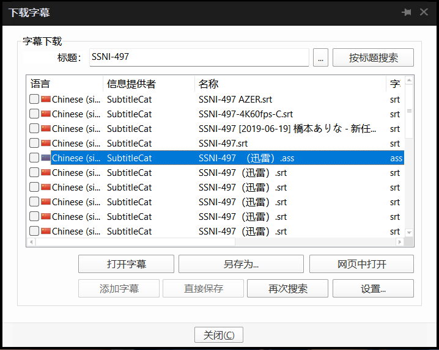

# PotPlayer JAV 中文字幕搜索插件

[](#版本说明)
[](https://potplayer.tv/)
[](#项目文件)
[](LICENSE)

为 [PotPlayer](https://potplayer.tv/) 提供在线字幕搜索与下载功能，面向 JAV 番号优化。插件会同时搜索 **SubtitleCat** 和 **迅雷字幕库**，无需注册账号或配置 API 密钥。

## 3.0 新功能

- 新增迅雷字幕源，与 SubtitleCat 搜索结果合并显示。
- 迅雷字幕名称后会显示 **`（迅雷）`**，方便区分来源。
- 支持直接下载迅雷返回的 `.srt`、`.ass` 等字幕格式。
- SubtitleCat 无结果或暂时不可用时，仍会继续返回迅雷字幕。



## 功能特点

- **双字幕源**：一次搜索同时查询 SubtitleCat 与迅雷字幕库。
- **番号识别**：从常见 JAV 文件名中提取并规范化番号，例如将 `SSNI497` 转换为 `SSNI-497`。
- **文件名清理**：移除网站前缀、方括号标签、视频扩展名以及 `1080p`、`4K`、`FHD` 等画质标记。
- **中文优先**：SubtitleCat 结果优先选择简体中文，其次选择繁体中文；迅雷结果按中文显示。
- **剧集支持**：可根据 PotPlayer 提供的季号、集号生成 `S01E02` 格式的搜索词。
- **无需登录**：两个字幕源均不要求在插件中填写账号、密码或 API 密钥。

## 安装方法

1. 安装或更新到较新的 PotPlayer 版本。
2. 在 PotPlayer 中按 `F5` 打开“选项”。
3. 进入“扩展功能” → “在线字幕搜索”，点击“打开文件夹”。
4. 将以下两个文件复制到打开的字幕搜索插件目录：

   - `SubtitleSearch - SubtitleCat.as`
   - `SubtitleSearch - SubtitleCat.ico`

5. 如果目录中已有旧版本文件，请直接覆盖，然后重启 PotPlayer 或重新加载在线字幕搜索插件。

## 使用方法

1. 使用 PotPlayer 播放本地视频。
2. 右键播放画面，进入“字幕” → “在线字幕搜索” → “下载字幕”。
3. 插件会清理视频标题，并同时搜索 SubtitleCat 和迅雷。
4. 在结果列表中选择需要的字幕，然后打开或保存。

迅雷结果示例：

```text
SSNI-497（迅雷）.ass
SSNI-497（迅雷）.srt
```

如果自动识别的标题不准确，可以在字幕下载窗口修改标题后点击“按标题搜索”。

## 工作原理

```text
视频标题
  ↓
清理网站标记、扩展名和画质标签
  ↓
提取并规范化 JAV 番号
  ↓
同时请求 SubtitleCat 与迅雷字幕接口
  ↓
解析并合并字幕结果
  ↓
为迅雷结果添加“（迅雷）”标识
  ↓
由 PotPlayer 下载并加载所选字幕
```

SubtitleCat 字幕会先进入详情页查找中文 `.srt` 文件；迅雷字幕接口直接返回字幕名称、格式和下载地址。两个来源使用独立的下载分支，因此一个来源失败不会影响另一个来源已经获得的结果。

## 搜索标题清理

插件会自动处理以下常见文件名：

| 原始文件名 | 搜索标题 |
| --- | --- |
| `[4K]SSNI-497.mp4` | `SSNI-497` |
| `example.com@SONE385_1080p.mkv` | `SONE-385` |
| `ABCD-123-FHD.avi` | `ABCD-123` |
| `Example.Show.S01E02.mkv` | `Example.Show S01E02` |

番号提取规则为 2–5 个英文字母加 2–5 个数字，最终统一为 `字母-数字` 格式。

## 支持的字幕格式与语言

- SubtitleCat：下载简体中文或繁体中文 `.srt` 字幕。
- 迅雷：按照接口返回格式下载，常见格式包括 `.srt` 和 `.ass`。
- PotPlayer 语言筛选列表包含简体中文、繁体中文、英语、日语、韩语等 27 种常用语言。

## 常见问题

### 搜索不到字幕

- 检查字幕下载窗口中的标题或番号是否正确。
- 删除标题中多余的发行组、演员名或其他说明后再次搜索。
- 确认当前网络可以访问 `subtitlecat.com` 和迅雷字幕接口。
- 某些新发行或冷门影片可能暂时没有可用字幕。

### 只显示一个字幕源的结果

两个来源相互独立。某个站点没有匹配字幕、响应超时或暂时无法访问时，插件仍会显示另一个来源成功返回的结果。

### 如何识别迅雷字幕

迅雷字幕的名称和保存文件名中都带有 **`（迅雷）`** 标识，例如 `SSNI-497（迅雷）.srt`。

### 蓝光文件没有自动搜索

为避免使用无意义的播放列表或分段文件名搜索，插件会跳过 `.mpls` 和 `.m2ts` 文件。请在字幕下载窗口手动输入影片标题或番号后搜索。

## 项目文件

| 文件 | 用途 |
| --- | --- |
| `SubtitleSearch - SubtitleCat.as` | PotPlayer 在线字幕搜索插件，使用 AngelScript 编写 |
| `SubtitleSearch - SubtitleCat.ico` | 插件图标 |
| `image/` | README 使用的安装和功能截图 |

## 版本说明

### 3.0

- 集成迅雷字幕搜索与直接下载。
- 搜索结果增加“（迅雷）”来源标识。
- 保留 SubtitleCat 中文搜索与下载功能。
- 提升单一字幕源不可用时的容错能力。

## 免责声明

本项目只提供字幕搜索插件实现，不存储、制作或分发字幕内容。字幕数据来自第三方服务，其可用性、准确性和版权状态由对应服务及内容提供者负责。请遵守所在地法律法规，并仅在合法范围内使用。

## 许可证

本项目采用 [MIT License](LICENSE)。
